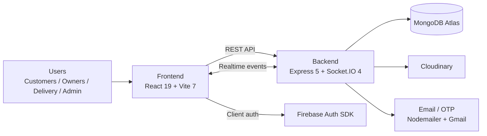
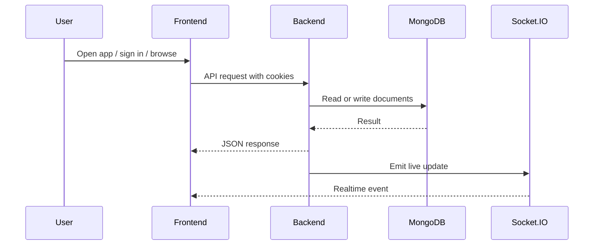
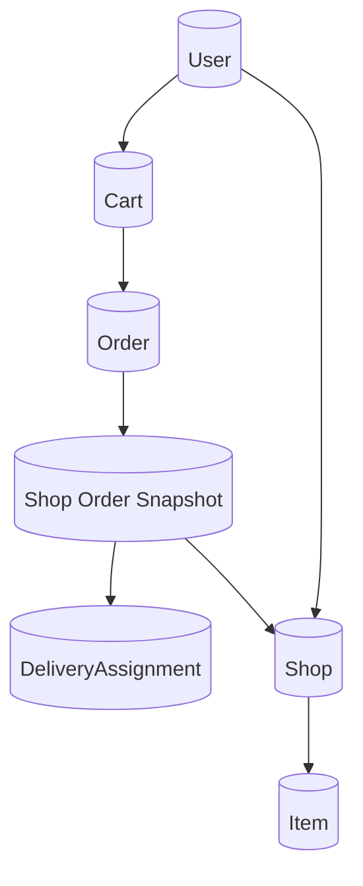

# Technical Architecture Document

## Product Name
Foody

## Architecture Summary
Foody is a two-part web application:
- A React/Vite frontend for customers, shop owners, delivery partners, and admins.
- An Express/MongoDB backend that handles authentication, shops, items, carts, orders, coupons, admin operations, file uploads, email OTPs, and real-time events.

The system is designed around a JSON API, cookie-based auth, MongoDB document models, and Socket.IO for live order and delivery updates.

## Architecture Overview
### System View

### Request Flow

### Data Flow

## Tech Stack
### Frontend
- React 19
- Vite 7
- React Router DOM 7
- Redux Toolkit 2
- React Redux 9
- Axios
- Socket.IO Client 4
- Tailwind CSS 3
- Leaflet and React Leaflet for map-based views
- Firebase Auth SDK for client-side auth integration
- React Icons
- React Spinners

### Backend
- Node.js
- Express 5
- MongoDB with Mongoose 9
- Socket.IO 4
- JSON Web Tokens
- bcryptjs for password hashing
- cookie-parser
- cors
- dotenv
- multer for file handling
- Cloudinary for image uploads
- Nodemailer for OTP and transactional emails
- nodemon for development

### Data and Infrastructure
- MongoDB as the primary database
- Cloudinary for media storage
- Gmail SMTP via Nodemailer for password reset and delivery OTP emails
- Socket.IO for real-time status delivery between client and server

### Recommended Deployment Shape
- Frontend: static hosting such as Vercel, Netlify, or similar
- Backend: Node.js hosting such as Render, Railway, Fly.io, or a VPS
- Database: MongoDB Atlas
- Media: Cloudinary

## File and Folder Structure
### Root
- `README.md` is currently empty and can be used later for project overview.
- `PRD.md` holds the product requirements document.
- `TECHNICAL_ARCHITECTURE.md` holds this engineering blueprint.
- `backend/` contains the API server and database logic.
- `frontend/` contains the React app.

### Backend
- `backend/index.js` boots the Express server, attaches Socket.IO, registers routes, and connects to MongoDB.
- `backend/socket.js` manages socket connection, identity, delivery location, and disconnect events.
- `backend/config/db.js` connects to MongoDB using `MONGOOSE_URL`.
- `backend/controllers/` contains route handlers for auth, users, shops, items, carts, orders, coupons, and admin.
- `backend/middlewares/` contains auth and upload middleware.
- `backend/models/` contains all MongoDB collections.
- `backend/routes/` maps HTTP endpoints to controllers.
- `backend/utils/` contains reusable helpers for errors, responses, tokens, mail, Cloudinary, async wrappers, and coupon logic.
- `backend/public/` is available for static assets if needed.

### Frontend
- `frontend/src/main.jsx` mounts the React app.
- `frontend/src/App.jsx` defines routing, data bootstrapping hooks, and the socket provider.
- `frontend/src/assets/pages/` contains page-level screens such as sign-in, sign-up, home, shop, cart, checkout, order tracking, add/edit item, and shop creation.
- `frontend/src/components/` contains reusable UI components and dashboards.
- `frontend/src/context/` contains shared app context such as `SocketContext`.
- `frontend/src/hooks/` contains data-fetching and sync hooks.
- `frontend/src/redux/` contains Redux store and slices.
- `frontend/src/index.css` and `frontend/src/App.css` contain global styling.
- `frontend/public/` holds public static files.

## Application Flow
### Request Flow
1. A user opens the frontend app in the browser.
2. React routes the user to the correct screen.
3. The frontend calls the backend API with Axios.
4. The backend authenticates the request with cookies and JWT where needed.
5. The backend reads or writes MongoDB documents through Mongoose.
6. For live actions, the backend emits Socket.IO events.
7. The frontend updates state in Redux and rerenders the UI.

### Auth Flow
1. A user signs up or signs in from the frontend.
2. The backend hashes passwords with bcryptjs.
3. The backend creates a JWT and stores it in an HTTP-only cookie.
4. Subsequent requests rely on that cookie for identity.
5. Password reset uses OTP email verification.

### Real-Time Flow
1. The frontend connects to Socket.IO through `SocketProvider`.
2. The client sends an `identity` event with the user ID.
3. Delivery partners can send location updates.
4. The backend broadcasts order or delivery updates to connected clients.

## Database Schema
Foody uses MongoDB documents rather than relational tables. The schema below describes the current collections in plain English.

### User
Stores all application users, including customers, shop owners, delivery partners, and super admins.

Fields:
- `fullName`: user’s display name
- `email`: unique login email
- `password`: hashed password when the account is created manually
- `mobile`: phone number
- `role`: `user`, `owner`, `deliveryBoy`, or `superadmin`
- `resetOtp`: OTP for password reset
- `isOtpVerified`: whether OTP verification succeeded
- `otpExpiry`: OTP expiration timestamp
- `socketId`: live socket connection ID
- `isOnline`: whether the user is currently connected
- `location`: GeoJSON point with `coordinates` for delivery tracking
- timestamps: created and updated dates

Relationships:
- One user can own many shops.
- One user can place many orders.
- One user can receive many delivery assignments.
- One user can have one active cart.

### Shop
Stores a food outlet or restaurant.

Fields:
- `name`: shop name
- `image`: shop image URL
- `owner`: reference to a `User`
- `city`: city where the shop operates
- `state`: state where the shop operates
- `address`: full shop address
- `items`: array of references to `Item`
- timestamps

Relationships:
- Each shop belongs to one owner.
- Each shop can contain many items.
- Each shop can have many related orders through the order model.

### Item
Stores a menu item sold by a shop.

Fields:
- `name`: item name
- `image`: item image URL
- `shop`: reference to a `Shop`
- `category`: item category such as Pizza, Burgers, Main Course, Chinese, or others
- `price`: numeric item price
- `foodType`: `veg` or `non veg`
- `rating.average`: average rating
- `rating.count`: number of ratings
- timestamps

Relationships:
- Each item belongs to one shop.
- Each item can appear in carts and orders as a snapshot.

### Cart
Stores the current active shopping cart for one user.

Fields:
- `userId`: unique reference to a `User`
- `outletId`: reference to a `Shop` for the active cart
- `items`: array of cart item snapshots
- `subtotal`: current cart subtotal
- timestamps

Cart item subdocument fields:
- `itemId`: reference to an `Item`
- `name`: item name snapshot
- `image`: item image snapshot
- `price`: item price snapshot
- `quantity`: selected quantity

Relationships:
- One user has at most one cart.
- One cart can contain many item snapshots.

### Order
Stores the final checkout record for a customer.

Fields:
- `user`: reference to a `User`
- `outletId`: reference to a `Shop`
- `paymentMethod`: `cod` or `online`
- `paymentStatus`: `pending`, `paid`, or `failed`
- `paymentId`: external payment reference
- `deliveryAddress.text`: delivery address text
- `deliveryAddress.latitude`: delivery latitude
- `deliveryAddress.longitude`: delivery longitude
- `totalAmount`: final order total
- `subtotal`: pre-fee subtotal
- `platformFee`: platform fee
- `packagingCharges`: packaging fee
- `taxAmount`: tax amount
- `deliveryCharges`: delivery fee
- `discountAmount`: discount applied
- `shopOrders`: array of shop-specific order groups
- timestamps

Shop-order subdocument fields:
- `shop`: reference to a `Shop`
- `owner`: reference to a `User`
- `subtotal`: shop-level subtotal
- `shopOrderItem`: array of ordered item snapshots
- `status`: `pending`, `preparing`, `out of delivery`, or `delivered`
- `assignment`: reference to a `DeliveryAssignment`
- `assignedDeliveryBoy`: reference to a `User`
- `deliveryOtp`: OTP used for delivery confirmation
- `otpExpires`: delivery OTP expiration
- `deliveredAt`: delivery completion timestamp

Shop-order item subdocument fields:
- `item`: reference to an `Item`
- `name`: item name snapshot
- `price`: item price snapshot
- `quantity`: ordered quantity

Relationships:
- One order belongs to one customer.
- One order can contain multiple shop orders.
- One shop order can be assigned to one delivery partner.

### DeliveryAssignment
Tracks the delivery dispatch lifecycle for a shop order.

Fields:
- `order`: reference to an `Order`
- `shop`: reference to a `Shop`
- `shopOrderId`: identifier for the shop-order segment
- `broadcastedTo`: array of `User` references who received the assignment
- `assignedTo`: reference to the delivery partner who accepted the task
- `status`: `broadcasted`, `assigned`, or `completed`
- `acceptedAt`: time the delivery was accepted
- timestamps

Relationships:
- One shop order can create one delivery assignment record.
- One delivery partner can receive many assignments over time.

## Environment and Configuration Notes
### Backend Environment Variables
- `MONGOOSE_URL`: MongoDB connection string.
- `JWT_SECRET`: secret used to sign and verify auth tokens.
- `PORT`: backend port, defaulting to `3000`.
- `NODE_ENV`: controls cookie security and cross-site behavior.
- `CLOUDINARY_CLOUD_NAME`: Cloudinary account name.
- `CLOUDINARY_API_KEY`: Cloudinary API key.
- `CLOUDINARY_API_SECRET`: Cloudinary API secret.
- `EMAIL`: Gmail account used for OTP emails.
- `PASS`: Gmail app password or SMTP password.

### Frontend Environment Variables
- `VITE_FIREBASE_API_KEY`: Firebase Web API key.

### Configuration Notes
- Do not hardcode database credentials, JWT secrets, or email passwords in source files.
- The backend currently allows CORS from `http://localhost:5173`; this should be updated for production domains.
- Cookies are configured to be secure only in production.
- Socket.IO is currently wired to the frontend origin on `localhost:5173`.
- Firebase config values that are not secrets are still embedded in the client build and should be reviewed before release.
- Uploaded images are sent to Cloudinary, not stored directly in the app.
- MongoDB geospatial location support is enabled on the user location field for delivery tracking use cases.

## Implementation Notes
- The current architecture is intentionally simple and fast to iterate on.
- The backend is monolithic, which is appropriate for the current stage.
- The data model favors embedded snapshots for carts and orders so historical order data remains stable even if item prices or names change later.
- Real-time updates are handled at the server layer rather than through polling.
- This architecture can be scaled later by splitting notifications, payments, and delivery orchestration into separate services if needed.
